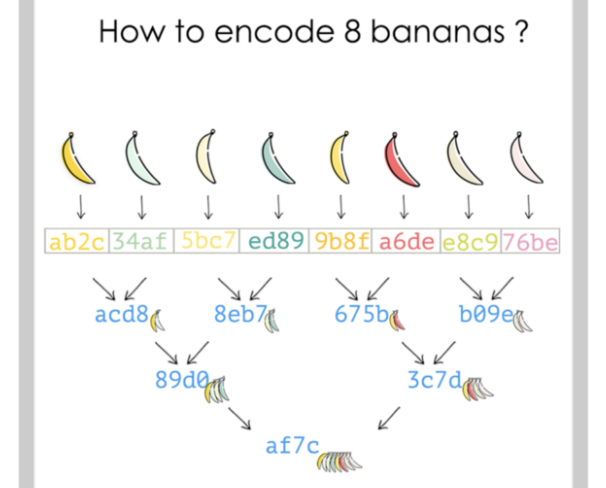
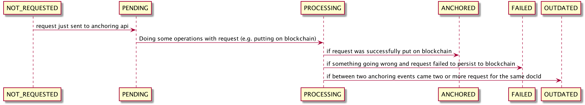

## Anchoring

#### Rationale

Anchoring module serves incoming requests from Wheel API.  
Wheel API module is a middleware for handling documents and querying Anchoring API module.  
Anchoring service works with Ethereum blockchain and [IPFS](https://en.wikipedia.org/wiki/InterPlanetary_File_System) -
protocol and P2P-based distributed file system.  
Anchoring mechanism is applied for making blockchain stamps of arbitrary documents and them states.

Talking in common duties of anchoring module are:
- putting (anchoring) data requests on blockchain
- responding with request data status
- responding with anchor info

Anchoring service operates with Anchoring requests.  
Anchoring request is the entity consists of canonical `docId` (aka Genesis record) and `cid` of new document state.

For example:

```
{
  "docId": "vessel://bafyreibw43tmfkw4az3ezb2dkiid6abwx2criw4te2jhti6k523cecjuxm",
  "cid": "bafyreibw43tmfkw4az3ezb2dkiid6abwx2criw4te2jhti6k523cecjuxm"
}
 ```

The purpose of anchoring is to make a stamp to blockchain about
current document state via its CID.  
CID (Content IDentifier) is self-describing content-addressed identifiers for distributed systems.  
In the same time, CID denote content-dependent address of IPFS block. 
Example:
`bafyreibw43tmfkw4az3ezb2dkiid6abwx2criw4te2jhti6k523cecjuxm`

While Anchoring API use machine-readable CID format (e.g. `bafyreibw43tmfkw4az3ezb2dkiid6abwx2criw4te2jhti6k523cecjuxm`)
it's good to understand what this string encodes.  
By CIDv1 format defined at https://github.com/multiformats/cid scheme of CID is:
```
<hr-cid> ::= <hr-mbc> "-" <hr-cid-mc> "-" <hr-mc> "-" <hr-mh>
```
- `<hr-mbc>` is a human-readable multibase code (eg `base58btc`)
- `<hr-cid-mc>` is the string `cidv#` (eg `cidv1` or `cidv2`)
- `<hr-mc>` is a human-readable multicodec code (eg `cbor`)
- `<hr-mh>` is a human-readable multihash (eg `sha2-256-256-abcdef0123456789...`)

For example:

```
# example CID
zb2rhe5P4gXftAwvA4eXQ5HJwsER2owDyS9sKaQRRVQPn93bA
# corresponding human readable CID
base58btc - cidv1 - raw - sha2-256-256-6e6ff7950a36187a801613426e858dce686cd7d7e3c0fc42ee0330072d245c95
```

Be more straightforward the CID is standard presentation of different types of hash values (calculated by various hash functions).
And this hash calculates from initial document content (for `docId` in request body, it's immutable for this document lifetime) and
changes (diffs) were made to this initial document (for `cid` in request body).


If anchoring service received multiple requests for the same
`docId` in anchoring interval then only last request will be anchored, others get 
status `OUTDATED`.

For more complete understanding of Anchoring working principle, it require to consider
Merkle trees and Merkle DAGs.

[Merkle tree](https://en.wikipedia.org/wiki/Merkle_tree) is an abstraction and data structure
 that's commonly using in blockchain industry. This structure allow us to compress
 big hash sequence into more compact one with possibility to check whether some hash was in initial 
 sequence or not.
 
 

<small>Image derived from: https://media.consensys.net/ever-wonder-how-merkle-trees-work-c2f8b7100ed3</small>
 
 There are several ways to hash data for Merkle tree at all. 
 In this particular Ethereum-based case `keccak256` (modified version of SHA-3 final release) hash function is used.
 
 DAGs stand for "Directed Acyclic Graphs", in other words - directed graph with no directed cycles, 
 there is no way to return in some vertex once we start from it.
 
 IPFS use Merkle DAGs instead of pure Merkle trees, the differences between them are:
 * DAGs does not requires to be balanced
 * Each DAG node can contain a value (payload)
 * Each DAG node can have multiple parent nodes
 
 When anchoring service handles new anchoring request the next actions occurs:
 - Merkle tree from incoming requests is created, taking `cid` field of requests as Merkle leaves values.
 - Merkle Root from Merkle tree is taken.
 - put Merkle root on blockchain.
 - put anchor proof to IPFS using next [IPDL](https://ipld.io) structure and getting `proofCid` as a result:
 ```
{
  blockNumber: t.number,
  blockTimestamp: t.number,
  root: CidIpldCodec,
  chainId: t.string.pipe(ChainIdStringCodec),
  txHash: CidIpldCodec,
}
```
 - extract from each request leaf data in the next format and put it on IPFS: 
 
```
{
  prev: new CID(request.cid),
  proof: proofCid,
  path: ipfsPath,
}
```
 
 - add information about blockchain transaction, IPFS anchor info, request info to database.
 
 Merkle tree operates with 3 basic terms:
 - Merkle root
 - Merkle proof
 - Examining hash  
 
Building of merkle tree:
- we are given with list of values or its hashes
- group hashes by two and calculate hash from this group
- group newly created hashes and repeat calculating of group hash
- if we got one hash -- it's a Merkle tree root. 

Brief example of Merkle tree:

We have array of hashes: 

`['0x1', '0x2', '0x3', '0x4']`

Let `hash('0x1' + '0x2')` will `'0x5'` and `hash('0x3' + '0x4')` will `'0x6'` then we've got

`['0x5', '0x6']`, do hashing operating again (Let `hash('0x5' + '0x6')` will `'0x7'`)

we've found Merkle tree root: `'0x7'` 

#### Structure of Anchoring Merkle node

Merkle node implemented as class template (A is a template variable):
```
{
    id: A,
    left?: MerkleNode<A>,
    right?: MerkleNode<A>,
    _uplink?: MerkleNode<A>
}
```

#### Lifecycle of the anchoring request

 

Lifecycle of request:
1. Request just sent to anchoring api: `PENDING`
2. Doing some operations with request (e.g. putting on blockchain): `PROCESSING`
3. If request was successfully put on blockchain: `ANCHORED`
4. If something going wrong and request failed to persist to blockchain: `FAILED`
5. If between two anchoring events came two or more request for the same docId, then any request except the very recent one become `OUTDATED`


Possible anchoring request statuses:
- `NOT_REQUESTED`: unknown request.
- `PENDING`: request was accepted, waiting for processing/anchoring.
- `PROCESSING`: currently processing request.
- `ANCHORED`: request data has successfully anchored (put on blockchain).
- `FAILED`: failed to put state to blockchain
- `OUTDATED`: request was superseded by more recent for the same vessel document in anchoring time interval.
The more recent one become `ANCHORED`.


### Running REST anchoring self-testing

In order to ensure the anchoring-api server/implementation is functioning according to vessel spec you may run
rest seft-testing.

```cd apps/anchoring-api```

There is a config file for rest testing called env.postman_environment.json.
Yes, config file, because there is no simple env variable passing to Postman's cmd. 
Please, insert actual values for 
- `base_protocol` (default: `http`)
- `base_host` (default: `localhost`)
- `base_port` (default: `3000`)

Then run the test suite via ```yarn test:rest```


### Anchoring endpoints

`GET /api/v0/requests` - get requests information including request list, total count of requests, page size (for pagination)

`GET /api/v0/requests/list/:cid` - get all anchor requests by `:cid`

`POST /api/v0/requests` - the record has been successfully created

`GET /api/v0/stats` - gather statistics about total amount of requests, total amount of anchors, pending requests, next anchoring time

`GET /api/v0/transactions` - gather statistics about transactions, total amount of transactions, page size (for pagination)

`GET /api/v0/health` - get API readiness

`GET /api/v0/anchors` - get anchor information including anchors, total count of anchors, page size (for pagination)

-- 

For handy Swagger docs run

```cd apps/anchoring-api```

```yarn start```

and go to http://localhost:3000/api/swagger
